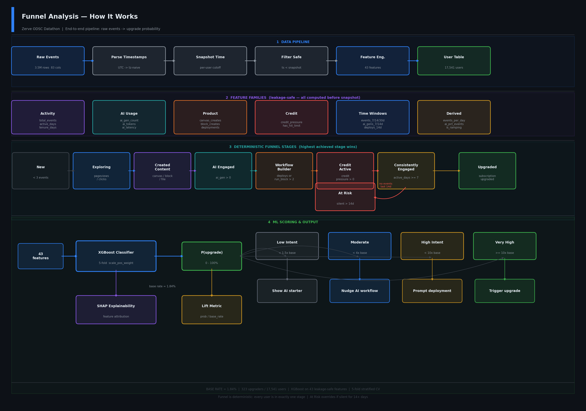
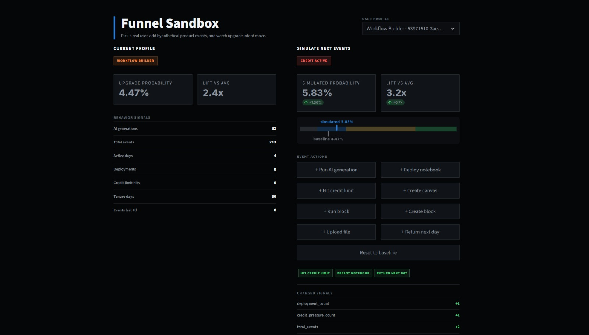

# Zerve ODSC Datathon — Upgrade Prediction & Funnel Analysis

A 24-hour datathon analysing 3.5 million product events from the Zerve AI platform to predict user upgrades and model the user journey.

---

## Challenges

### Challenge 1 — Predict Upgrades

Build a machine-learning model that estimates the probability a free-tier user will upgrade to a paid plan, using only behaviour observed **before** the upgrade event.

**Approach:**
- Defined a per-user snapshot time (first upgrade timestamp for upgraders, global max for non-upgraders)
- Filtered all features to strictly pre-snapshot events — no leakage
- Engineered 43 behavioural features across activity, AI usage, deployments, credit pressure, and time windows
- Trained XGBoost with 5-fold stratified cross-validation (`scale_pos_weight` for class imbalance)
- Explained predictions with SHAP values

**Results:**
- Base upgrade rate: **1.84%** (323 upgraders out of 17,541 users)
- Top predictors: `ai_gen_count`, `total_events`, `credit_pressure_count`, `unique_event_types`, `tenure_days`
- Upgraders generate **11.7× more events** than non-upgraders (median 199 vs 17)
- Median upgrader converts after just **1 day** of tenure — value must land fast

---

### Challenge 2 — Deterministic User Funnel

Classify every user into exactly one ordered stage at any point in time, based purely on observed behaviour.

**Funnel stages (in order):**

| Stage | Definition |
|---|---|
| New | Signed up, fewer than 3 events |
| Exploring | Has pageviews, clicks, or navigation events |
| Created Content | Has created a canvas, block, file, or workspace object |
| AI Engaged | Has triggered at least one AI generation |
| Workflow Builder | Has deployments or run_block count > 2 |
| Credit Active | Has consumed credits (credit pressure > 0) |
| Consistently Engaged | Active across 7 or more days |
| Upgraded | Has a `subscription_upgraded` event |
| At Risk | Previously engaged but silent for 14+ days — overrides any stage |

Each user is assigned their **highest achieved stage** as of any given timestamp, making the funnel fully deterministic and time-aware.

---

## Why is the Conversion Rate Only 1.84%?

At first glance 323 upgraders out of 17,541 users looks low. It isn't anomalous — here's why.

**1. This is normal for PLG SaaS**
Free-to-paid conversion rates in product-led growth models typically sit between 2–5% for mature products and lower for early-stage platforms. Zerve is competing in the AI data tooling space where users have many free alternatives, so a sub-2% rate is expected, not alarming.

**2. The free tier is genuinely useful**
Users get free credits and can run AI generations, build canvases, and deploy notebooks without paying. A generous free tier by design depresses conversion — users only need to upgrade when they hit limits. This is intentional PLG strategy: land broadly, convert the power users.

**3. Credit pressure is the actual trigger — and it's rare**
The `credit_pressure_count` feature is a top upgrade predictor. Most casual users never exhaust their free credits, so the upgrade trigger never fires. Only heavy AI users burn through them quickly.

**4. Upgraders convert in the first 1–3 days**
The median upgrader's tenure is 1 day. Users who don't convert quickly tend to stay on the free tier indefinitely. There is no slow-burn conversion path evident in the data.

**5. Many users are explorers, not buyers**
A meaningful share of signups are students or hobbyists who have no intent to pay — they inflate the denominator without ever being real conversion candidates.

**6. The dataset window may not capture delayed conversions**
Users who signed up near the end of the observation period haven't had time to convert yet. The true eventual conversion rate is likely higher than the snapshot shows.

**The takeaway:** the 1.84% figure reflects a healthy free tier doing its job. The real question — which the model answers — is *which* of the remaining 98% are most worth activating.

---

## Key Behavioural Insights

**Insight 1 — AI Power Users Drive Upgrades**
Users who ran 10+ AI generations were dramatically more likely to upgrade. AI usage is the single strongest pre-upgrade signal in the dataset.

**Insight 2 — Deployment Intent is a Strong Secondary Signal**
A disproportionate share of upgraders had deployment-related events (`notebook_deployed`, `app_deployed`) before converting — even though only a minority of users deploy at all.

**Insight 3 — Early Engagement Predicts Long-Term Conversion**
Users who triggered their first AI generation within 3 days of signup converted at significantly higher rates. The activation window is narrow.

---

## Apps

### Funnel Sandbox (`funnel_sandbox/`)

An interactive Streamlit app for exploring real user profiles and simulating product events. Two-panel layout: the left panel shows a real user's feature profile, funnel stage, and upgrade probability; the right panel lets you fire simulated events (AI generation, deployment, credit limit hit, etc.) and watch the probability shift in real time.

Built to answer: *if this user does X next, how much does their upgrade probability change?*

### Funnel Command Center (`funnel_command_center/`)

An executive-level Streamlit dashboard with KPIs, segment breakdowns, opportunity scoring, and model diagnosis. Four tabs covering overview metrics, user segmentation, high-intent user identification, and SHAP-based feature diagnosis.

---

## File Reference

### Root

| File | Description |
|---|---|
| `t1.ipynb` | Main analysis notebook — runs end-to-end from raw data to trained model, funnel, insights, and all visualisations |
| `build_cache.py` | Standalone script that pre-computes the 43-feature user table from `zerve_events.csv` and saves it to `reports/user_features.pkl` — run once before launching either app |
| `generate_flow.py` | Generates the funnel analysis flow diagram saved to `reports/funnel_analysis_flow.png` |
| `requirements.txt` | Python dependencies |
| `README.md` | This file |

### `datasets/`

| File | Description |
|---|---|
| `zerve_events.csv` | Raw event log — 3,509,628 rows, 83 columns, one row per product event |
| `data_dictionary.csv` | Column reference: data types, null rates, descriptions, and sample values for all 83 columns |

### `reports/`

| File | Description |
|---|---|
| `user_features.pkl` | Pre-computed feature table — 17,541 users, 43 features (built by `build_cache.py`) |
| `xgb_model.pkl` | Trained XGBoost binary classifier |
| `feature_cols.pkl` | Ordered list of the 43 feature column names used by the model |
| `funnel_analysis_flow.png` | End-to-end pipeline flow diagram — data ingestion through ML scoring (generated by `generate_flow.py`) |
| `event_type_upgrade_report.csv` | Pre-ranked table of all event types scored by commercial intent, leakage risk, and upgrade signal strength |
| `event_type_upgrade_report.md` | Markdown version of the event type report |
| `data_dictionary_notes.md` | Annotated notes on key data quirks and gotchas discovered during exploration |
| `zerve_upgrade_prediction_project_report.pdf` | Full project report PDF |
| `fig1_model_performance.png` | ROC-AUC and PR-AUC curves across 5-fold cross-validation |
| `fig2_feature_importance.png` | Top-20 feature importances averaged across folds |
| `fig3_funnel_chart.png` | Deterministic user funnel — stage counts as of dataset end date |
| `fig4_insight1_ai_usage.png` | AI generation count distribution: upgraders vs non-upgraders |
| `fig5_daily_trend.png` | Daily event volume trend over the observation period |
| `fig6_retention_heatmap.png` | Retention cohort heatmap (Day-0 through Day-30) |
| `fig7_segmentation.png` | Upgrade rate segmentation by user persona |
| `fig8_distribution.png` | Total events and active days distribution: upgraders vs non-upgraders |
| `fig9a_shap_beeswarm.png` | SHAP beeswarm plot — per-user feature impact on upgrade probability |
| `fig9b_shap_bar.png` | SHAP bar plot — mean absolute feature importance |
| `fig10_risk_tiers.png` | Upgrade risk tier distribution across the user base |
| `fig11_transition_matrix.png` | Stage transition matrix (T−30 → T−now) |
| `fig12_time_to_stage.png` | Median days for users to reach each funnel stage |

### `funnel_sandbox/`

| File | Description |
|---|---|
| `main.py` | Streamlit app — real user profile viewer and event simulator |
| `reports/xgb_model.pkl` | Model copy local to the app |
| `reports/feature_cols.pkl` | Feature column list local to the app |
| `reports/user_features.pkl` | Feature cache local to the app |

### `funnel_command_center/`

| File | Description |
|---|---|
| `main.py` | Streamlit executive dashboard — KPIs, segments, opportunities, diagnosis |
| `reports/xgb_model.pkl` | Model copy local to the app |
| `reports/feature_cols.pkl` | Feature column list local to the app |
| `reports/user_features.pkl` | Feature cache local to the app |
| `reports/fig2_feature_importance.png` | Feature importance chart used in the Diagnosis tab |

---

## Dataset

| Property | Value |
|---|---|
| Rows | 3,509,628 |
| Columns | 83 |
| Grain | One row per product event |
| Core fields | `person_id`, `timestamp`, `event` |
| Target event | `subscription_upgraded` |
| Total users | 17,541 |
| Upgrade rate | 1.84% (323 upgraders) |

Key data notes:
- `properties.$ai_latency` is in **seconds**, not milliseconds
- `properties.credits_remaining` is only populated when the balance hits zero; all non-null values are `0.0`
- Many null columns are structural — a field is missing because it does not apply to that event type, not because data is absent

---

## Pipeline Overview

The diagram below shows the full end-to-end pipeline: from raw event ingestion and feature engineering, through the deterministic funnel stages, to XGBoost scoring and action tiers.



The four sections map directly to the four stages of the project:
1. **Data Pipeline** — raw CSV ingestion, timestamp parsing, per-user snapshot filtering, and feature computation
2. **Feature Families** — 43 leakage-safe features grouped by activity, AI usage, product depth, credit pressure, time windows, and derived ratios
3. **Deterministic Funnel** — rule-based stage assignment; every user occupies exactly one stage; At Risk overrides any stage if the user has been silent for 14+ days
4. **ML Scoring** — XGBoost outputs an upgrade probability, converted to a lift score relative to the 1.84% base rate, routed into four intent tiers, each mapped to a recommended action

---

## Funnel Sandbox App

The Funnel Sandbox lets you explore real users from the dataset and simulate how product events shift their upgrade probability.



The left panel shows a real user's feature profile, current funnel stage, and predicted upgrade probability. The right panel provides event buttons — triggering an AI generation, deploying a notebook, hitting the credit limit — and updates the probability in real time. It turns the static model into an interactive tool for understanding exactly what drives conversion for each type of user.

### Running the apps

**Prerequisites**

```bash
conda activate zerve-odsc
python build_cache.py        # builds reports/user_features.pkl — run once
```

**Funnel Sandbox**

```bash
pip install -r funnel_sandbox/requirements.txt
streamlit run funnel_sandbox/main.py
```

**Funnel Command Center**

```bash
pip install -r funnel_command_center/requirements.txt
streamlit run funnel_command_center/main.py
```

The Command Center is an executive dashboard with KPIs, segment breakdowns, high-intent user identification, and SHAP-based feature diagnosis across the full user base.
